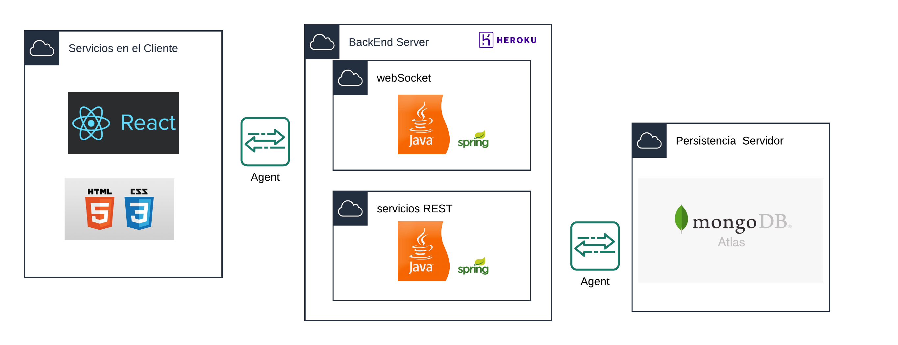
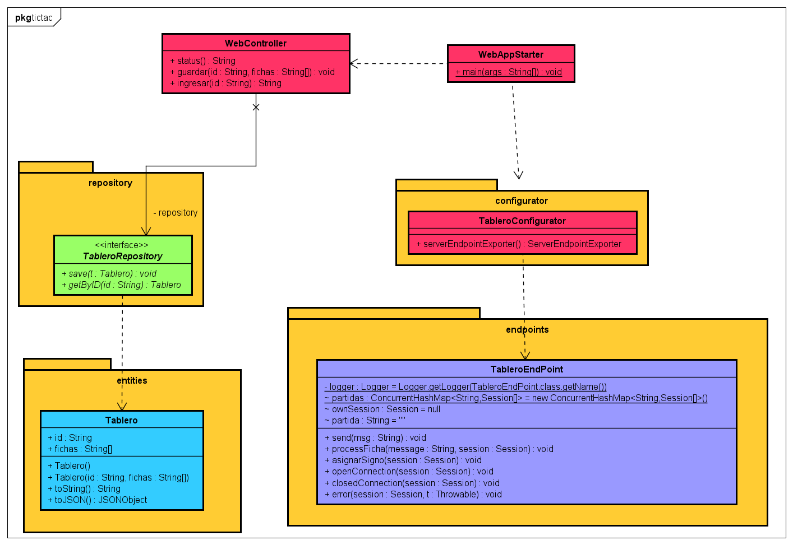
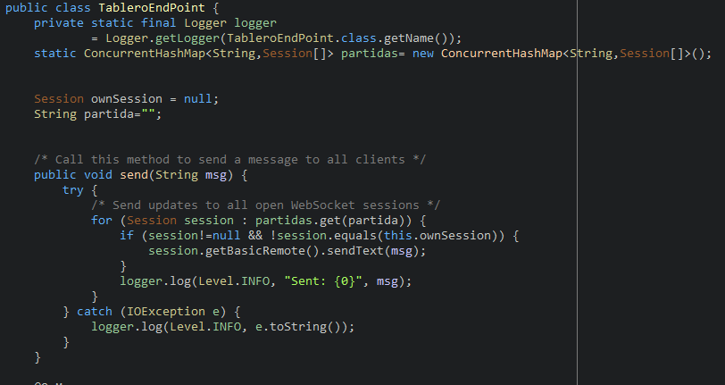
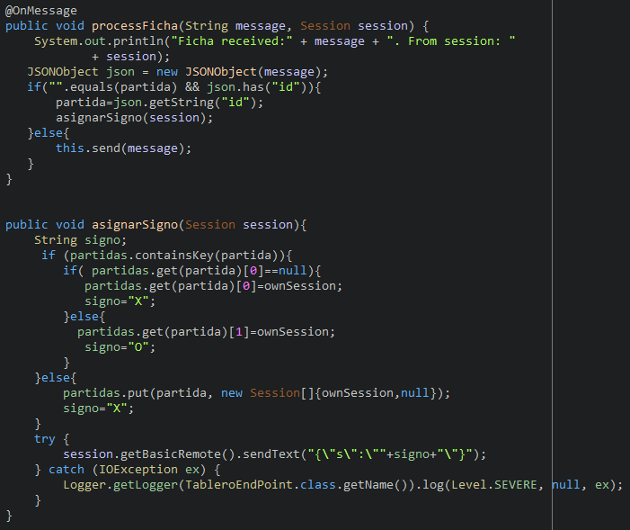
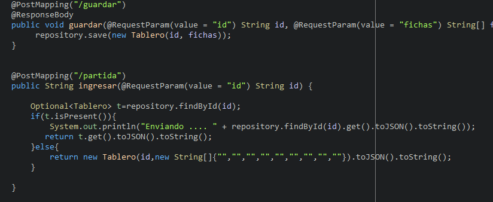
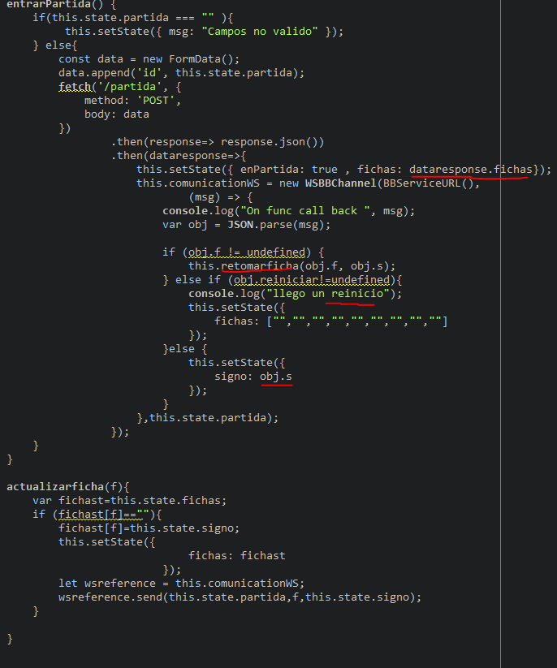

# Tic Tac Toe Real-Time

Una app web que permite jugar online a través de salas independientes.

## LOC/h

Gaste aprox 14 horas.

 40 LOC/h

## Autor
* **J. Eduardo Arias Barrera** -  [AriasAEnima](https://github.com/AriasAEnima)

# Diagrama General

## Diseño

Tenemos un sistema de sockets con el cual el servidor repartirá adecuadamente los mensajes a quienes deban llegar, resolverá mensajes de reinicio y de petición de símbolo a usar (X u O).

En la parte Rest que si hay una partida existente en la base de Mongo la devolvera de caso contrario , devolvera un objeto vacio (que no existe en la base de datos). Y el servicio de guardar en la base de datos el estado actual de la partida.

## Partes Importantes del Código:

### En el back :

Como se relacionan las sesiones a traves del id de la partida.

Como se procesan los mensajes que llegan:
- Si el WebSocket aun no tiene determinada la partida que pertenece y en cliente le dice que quiere estar en la correspondiente id, se sabe que es de los primeros mensajes por lo tanto se agregará (o se adiciona como segundo jugador) al hashmap de partidas y se le debe responder con el signo que debe jugar.

Como se guardan los tableros

Aqui podemos ver que primero se consulta al servidor la partida, una vez esto se realice se inicia un socket con 3 alternativas.
- La primera que es un mensaje normal de partida , donde se pulsa un campo
- La segunda que llegue un reinicio.
- La tercera en el que el servidor no envia una ficha y que su proposito es que se asigne un signo al cliente.

## Heroku :

## [Link Heroku](https://tic-tac-toe-arias.herokuapp.com/)

## Licencia

This project is licensed under the MIT License  - see the [LICENSE](LICENSE) file for details
